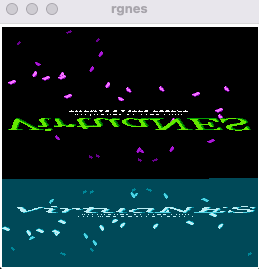
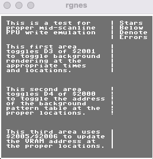

# rgnes

This NES emulator is implemented for my study

Most of the code in rgnes was based on the following.
It's great because it's written so simple.

- https://github.com/fogleman/nes

## TODOs

- Refactoring
- Many bug fixes
- Support for many mappers

.. and tons more

## Screenshots

  
  
  
  
  
  

## Controls

| Nintendo | Emulator |
| - | - |
| Up, Down, Left, Right	| Arrow Keys |
| Start | Enter |
| Select | Space |
| Reset | R |
| A | Z |
| B | X |

## Test ROM Results

| Test | SingleRom | Result |
| - | - | - |
| apu_mixer | dmc.nes | ✅ |
| apu_mixer | noise.nes | ✅ |
| apu_mixer | square.nes | ✅ |
| apu_mixer | triangle.nes | ✅ |
| apu_test | 1-len_ctr.nes | ✅ |
| apu_test | 2-len_table.nes | ✅ |
| apu_test | 3-irq_flag.nes | ✅ |
| apu_test | 4-jitter.nes | ✅ |
| apu_test | 5-len_timing.nes | ✅ |
| apu_test | 6-irq_flag_timing.nes | ✅ |
| apu_test | 7-dmc_basics.nes | ✅ |
| apu_test | 8-dmc_rates.nes | ✅ |
| apu_reset | 4015_cleared.nes | ✅ |
| apu_reset | 4017_timing.nes  | ❌ |
| apu_reset | 4017_written.nes  | ❌ |
| apu_reset | irq_flag_cleared.nes | ✅ |
| apu_reset | len_ctrs_enabled.nes | ✅ |
| apu_reset | works_immediately.nes | ❌ |
| blargg_apu_2005.07.30 | 01.len_ctr.nes | ✅ |
| blargg_apu_2005.07.30 | 02.len_table.nes  | ✅ |
| blargg_apu_2005.07.30 | 03.irq_flag.nes | ✅ |
| blargg_apu_2005.07.30 | 04.clock_jitter.nes  | ✅ |
| blargg_apu_2005.07.30 | 05.len_timing_mode0.nes | ✅ |
| blargg_apu_2005.07.30 | 06.len_timing_mode1.nes | ✅ |
| blargg_apu_2005.07.30 | 07.irq_flag_timing.nes | ✅ |
| blargg_apu_2005.07.30 | 08.irq_timing.nes | ✅ |
| blargg_apu_2005.07.30 | 09.reset_timing.nes | ✅ |
| blargg_apu_2005.07.30 | 10.len_halt_timing.nes | ❌ |
| blargg_apu_2005.07.30 | 11.len_reload_timing.nes | ❌ |
| blargg_ppu_tests_2005.09.15b | palette_ram.nes | ✅ |
| blargg_ppu_tests_2005.09.15b | power_up_palette.nes | ✅ |
| blargg_ppu_tests_2005.09.15b | sprite_ram.nes  | ✅ |
| blargg_ppu_tests_2005.09.15b | vbl_clear_time.nes | ✅ |
| blargg_ppu_tests_2005.09.15b | vram_access.nes  | ✅ |
| branch_timing_tests | 1.Branch_Basics.nes | ✅ |
| branch_timing_tests | 2.Backward_Branch.nes | ✅ |
| branch_timing_tests | 3.Forward_Branch.nes  | ✅ |
| cpu_dummy_reads | cpu_dummy_reads.nes | ✅ |
| cpu_dummy_writes | cpu_dummy_writes_oam.nes | ✅ |
| cpu_dummy_writes | cpu_dummy_writes_ppumem.nes | ✅ |
| cpu_exec_space | test_cpu_exec_space_apu.nes | ❌ |
| cpu_exec_space | test_cpu_exec_space_ppuio.nes | ✅ |
| cpu_interrupts_v2 | 1-cli_latency.nes | ✅ |
| cpu_interrupts_v2 | 2-nmi_and_brk.nes | ✅ |
| cpu_interrupts_v2 | 3-nmi_and_irq.nes | ✅ |
| cpu_interrupts_v2 | 4-irq_and_dma.nes | ✅ |
| cpu_interrupts_v2 | 5-branch_delays_irq.nes | ❌ |
| cpu_reset | ram_after_reset.nes | ❌ |
| cpu_reset | registers.nes | ❌ |
| cpu_timing_test6 | cpu_timing_test.nes | ✅ |
| dmc_dma_during_read4 | dma_2007_read.nes | ❌ |
| dmc_dma_during_read4 | dma_2007_write.nes | ✅ |
| dmc_dma_during_read4 | dma_4016_read.nes | ❌ |
| dmc_dma_during_read4 | double_2007_read.nes | ❌ |
| dmc_dma_during_read4 | read_write_2007.nes | ✅ |
| instr_misc | 01-abs_x_wrap.nes | ✅ |
| instr_misc | 02-branch_wrap.nes | ✅ |
| instr_misc | 03-dummy_reads.nes | ✅ |
| instr_misc | 04-dummy_reads_apu.nes | ❌ |
| instr_test-v5 | 01-basics.nes | ✅ |
| instr_test-v5 | 02-implied.nes | ✅ |
| instr_test-v5 | 03-immediate.nes | ✅ |
| instr_test-v5 | 04-zero_page.nes | ✅ |
| instr_test-v5 | 05-zp_xy.nes | ✅ |
| instr_test-v5 | 06-absolute.nes | ✅ |
| instr_test-v5 | 07-abs_xy.nes | ✅ |
| instr_test-v5 | 08-ind_x.nes | ✅ |
| instr_test-v5 | 09-ind_y.nes | ✅ |
| instr_test-v5 | 10-branches.nes | ✅ |
| instr_test-v5 | 11-stack.nes | ✅ |
| instr_test-v5 | 12-jmp_jsr.nes | ✅ |
| instr_test-v5 | 13-rts.nes | ✅ |
| instr_test-v5 | 14-rti.nes | ✅ |
| instr_test-v5 | 15-brk.nes | ✅ |
| instr_test-v5 | 16-special.nes | ✅ |
| nestest | nestest.nes | ✅ |
| oam_read | oam_read.nes | ✅ |
| oam_stress | oam_stress.nes | ✅ |
| ppu_open_bus | ppu_open_bus.nes | ✅ |
| ppu_read_buffer | test_ppu_read_buffer.nes | ✅ |
| ppu_vbl_nmi | 01-vbl_basics.nes | ✅ |
| ppu_vbl_nmi | 02-vbl_set_time.nes | ✅ |
| ppu_vbl_nmi | 03-vbl_clear_time.nes | ✅ |
| ppu_vbl_nmi | 04-nmi_control.nes  | ✅ |
| ppu_vbl_nmi | 05-nmi_timing.nes  | ✅ |
| ppu_vbl_nmi | 06-suppression.nes | ✅ |
| ppu_vbl_nmi | 07-nmi_on_timing.nes | ✅ |
| ppu_vbl_nmi | 08-nmi_off_timing.nes | ✅ |
| ppu_vbl_nmi | 09-even_odd_frames.nes | ✅ |
| ppu_vbl_nmi | 10-even_odd_timing.nes | ❌ |
| sprdma_and_dmc_dma | sprdma_and_dmc_dma.nes | ❌ |
| sprdma_and_dmc_dma | sprdma_and_dmc_dma_512.nes | ❌ |
| sprite_hit_tests_2005.10.05 | 01.basics.nes | ✅ |
| sprite_hit_tests_2005.10.05 | 02.alignment.nes | ✅ |
| sprite_hit_tests_2005.10.05 | 03.corners.nes | ✅ |
| sprite_hit_tests_2005.10.05 | 04.flip.nes | ✅ |
| sprite_hit_tests_2005.10.05 | 05.left_clip.nes | ✅ |
| sprite_hit_tests_2005.10.05 | 06.right_edge.nes | ✅ |
| sprite_hit_tests_2005.10.05 | 07.screen_bottom.nes | ✅ |
| sprite_hit_tests_2005.10.05 | 08.double_height.nes | ✅ |
| sprite_hit_tests_2005.10.05 | 09.timing_basics.nes | ✅ |
| sprite_hit_tests_2005.10.05 | 10.timing_order.nes | ✅ |
| sprite_hit_tests_2005.10.05 | 11.edge_timing.nes | ✅ |
| sprite_overflow_tests | 1.Basics.nes | ✅ |
| sprite_overflow_tests | 2.Details.nes | ✅ |
| sprite_overflow_tests | 3.Timing.nes | ✅ |
| sprite_overflow_tests | 4.Obscure.nes | ✅ |
| sprite_overflow_tests | 5.Emulator.nes | ✅ |
| vbl_nmi_timing | 1.frame_basics.nes | ✅ |
| vbl_nmi_timing | 2.vbl_timing.nes | ✅ |
| vbl_nmi_timing | 3.even_odd_frames.nes | ✅ |
| vbl_nmi_timing | 4.vbl_clear_timing.nes | ✅ |
| vbl_nmi_timing | 5.nmi_suppression.nes | ✅ |
| vbl_nmi_timing | 6.nmi_disable.nes | ✅ |
| vbl_nmi_timing | 7.nmi_timing.nes | ✅ |

## References

- https://www.nesdev.org/wiki/NES_reference_guide
- https://github.com/fogleman/nes
- [ファミコンエミュレータの創り方　- Hello, World!編 -](https://qiita.com/bokuweb/items/1575337bef44ae82f4d3)
- [Writing NES Emulator in Rust](https://bugzmanov.github.io/nes_ebook/chapter_1.html)
- [ｷﾞｺ猫でもわかるファミコンプログラミング](http://gikofami.fc2web.com/index.html)
- [NES研究室](http://hp.vector.co.jp/authors/VA042397/nes/index.html)
- [NES on FPGA](https://pgate1.at-ninja.jp/NES_on_FPGA/index.html)

## License
rgnes is licensed under the MIT license
